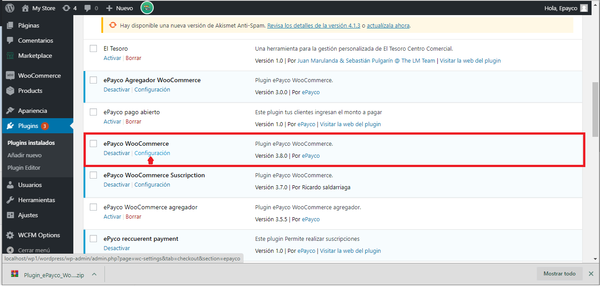
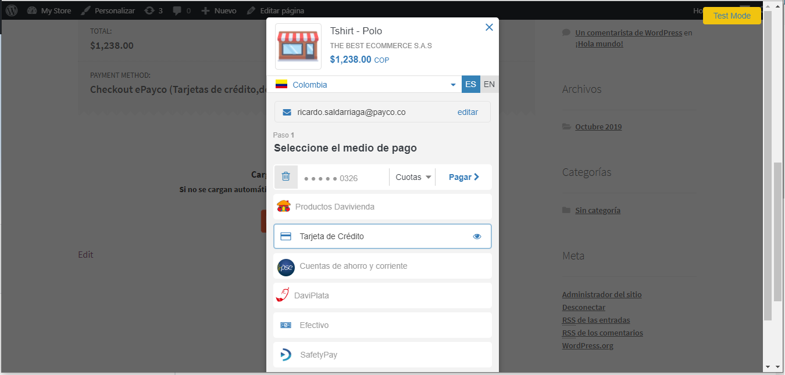

#ePayco plugin para Dokan

**Si usted tiene alguna pregunta o problema, no dude en ponerse en contacto con nuestro soporte técnico: desarrollo@epayco.com.**

** Se recomienda emplear la última versión disponible. **

## Versiones
* [epayco plugin WooCommerce v1.0.0](https://github.com/epayco/epayco-dokan/releases/tag/1.0.0).

## Tabla de contenido

* [Requisitos](#requisitos)
* [Instalación](#instalación)
* [Pasos](#pasos)
* [Versiones](#versiones)

## Requisitos

* Tener una cuenta activa en [ePayco](https://epayco.com/).
* Tener instalado WordPress, WooCommerce y Dokan.
* Acceso a las carpetas donde se encuetra instalado WordPress y WooCommerce.
* Acceso al admin de WordPress.

## Instalación

1. [Descarga el plugin.](https://github.com/epayco/epayco-dokan#versiones)
2. Ingresa al administrador de tu wordPress.
3. Ingresa a Plugins / Añadir-Nuevo / Subir-Plugin. 
4. Busca el plugin descargado en tu equipo y súbelo como cualquier otro archivo.
5. Después de instalar el .zip lo puedes ver en la lista de plugins instalados , puedes activarlo o desactivarlo.
6. Para configurar el plugin debes ir a: WooCommerce / Ajustes / Finalizar Compra y Ubica la pestaña ePayco.
7. Configura el plugin ingresando el **P_CUST_ID_CLIENTE**, **PUBLIC_KEY** y **P_KEY**, los puedes ver en tu [panel de clientes](https://dashboard.epayco.com/login).
8. Realiza la configuración correspondiente en Dokan de cada vendedor con su respectivos valores.
9. Realiza la respectiva configuración del producto en Woocommerce asignando el vendedor correspondiente que sera asociado a ese producto e ingrese el id del cliente de epayco al cual se le otorgara la comisión de venta del producto seleccionado
10. Selecciona o crea una página de respuesta donde el usuario será devuelto después de finalizar la compra.
11. Realiza una o varias compras para comprobar que todo esté bien.
12. Si todo está bien recuerda cambiar la variable Modo Prueba a NO y empieza a recibir pagos de forma instantánea y segura con ePayco.

## Pasos

